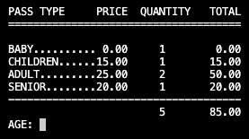
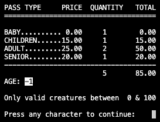
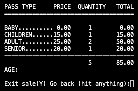
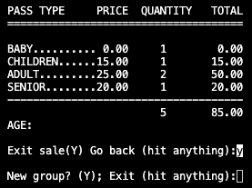
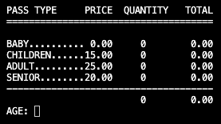

# Group Pass Calculator Based on Age of Visitors

## Exercise: Group Entrance Price Calculation

**Objective:**
Develop a program that calculates the total entrance price for a group of visitors to a zoo based on their ages. The program should also provide a detailed breakdown of prices by age group.

**Price Rules:**
- Babies aged 2 years or younger: Free entry.
- Children aged 3 to 12 years: 14 euros.
- Adults aged 13 years and older: 23 euros.
- Seniors (65 years and older): 18 euros.

## Instructions:
1. **Data Entry:**
   - The program should ask users for the ages of group members one by one.
   - Data entry temporarily stops when a character/s (or absence of character/s) different than numbers from 0 to 100 are entered

2. **Validation:**
   - Ensure that entered ages are positive integers between 0 - 100

3. **Price Calculation:**
   - Calculate the total price for the group based on the price rules.
   - Provide a detailed breakdown of the cost for each age range.

4. **Output:**
   - Upon completing data entry, display the total price for the group.
   - Show a detailed breakdown of prices by age group.

## Implementation Help:
Data structures like lists or tuples can be used to store ages and prices as they are entered.

## Execution Example: normal usage:

1. Enter visitor's age: 0 & "enter"
2. Enter visitor's age: 12 & "enter"
3. Enter visitor's age: 25 & "enter"
4. Enter visitor's age: 45 & "enter"
5. Enter visitor's age: 70 & "enter"

If the users keeps introducing ages, the program keeps adding values.

## Execution Example: age introduced out of range (0-100)

1. Enter visitor's age: 0 & "enter"
2. Enter visitor's age: 12 & "enter"
3. Enter visitor's age: 25 & "enter"
4. Enter visitor's age: 45 & "enter"
5. Enter visitor's age: 70 & "enter"
6. Enter visitor's age: -1 & "enter"

If user hits any character other than the numbers from 1 - 100 the program assumes the character introduced was a human error and the following message shows up

The user must hit any character in order to go back to the console. No other alternative is provided to the user.

## Execution Example: exit group in order to start a new age group

1. Enter visitor's age: 0 & "enter"
2. Enter visitor's age: 12 & "enter"
3. Enter visitor's age: 25 & "enter"
4. Enter visitor's age: 45 & "enter"
5. Enter visitor's age: 70 & "enter"
6. Enter visitor's age: "enter"

If the intention of the user was to start a new age group, the user must hit "Y" and "enter". At this point an additional option is offered to the user: if "enter" was hit by mistake, the software allows to hit any character to go back and add additional ages to the group.

However, if the original intention of the user was to start a new age group, the user must clic "Y" & "enter".

At this stage, the user must hit "Y" & "enter" again to start with a new group and to clean the console:

## Execution Example: exit program

If the intention of the user is to exit the program, the user must hit any character & "enter" or hit "enter" when found in this step:

## Final Considerations:
- Ensure the program handles invalid inputs correctly and prompts for age re-entry if an incorrect value is entered.
- The program should be user-friendly and provide clear and accurate results.